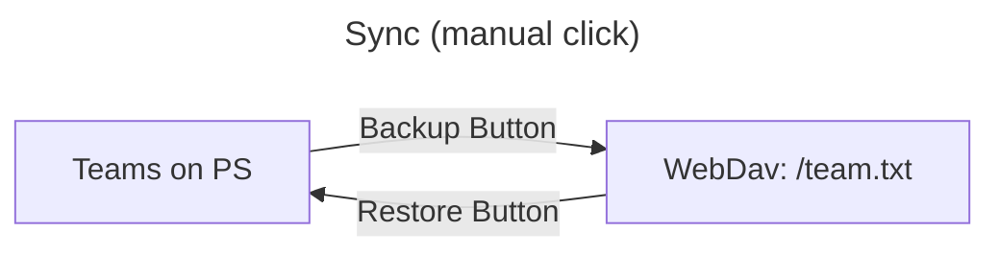
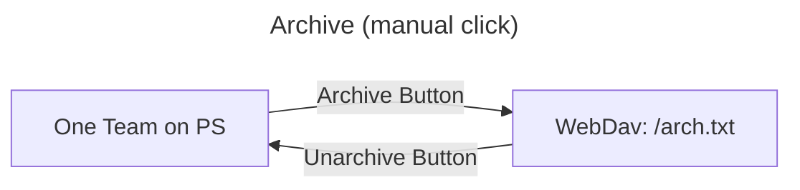
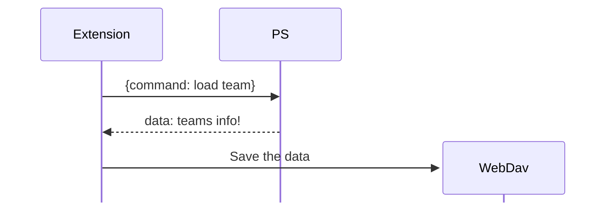

## PS-Sync
sync [PokemonShowdown](https://play.pokemonshowdown.com/)'s team with your webdav





## Code Structure
### 1. Sync part

### 2. Arch part
Similar to the sync part

## Built With
* [WebDav](https://github.com/perry-mitchell/webdav-client)
``` sh
npm run build:web
```

``` javascript
 output: {
    environment: { module: false },
    library: { type: "window", name: 'WebDAV' }
}
```